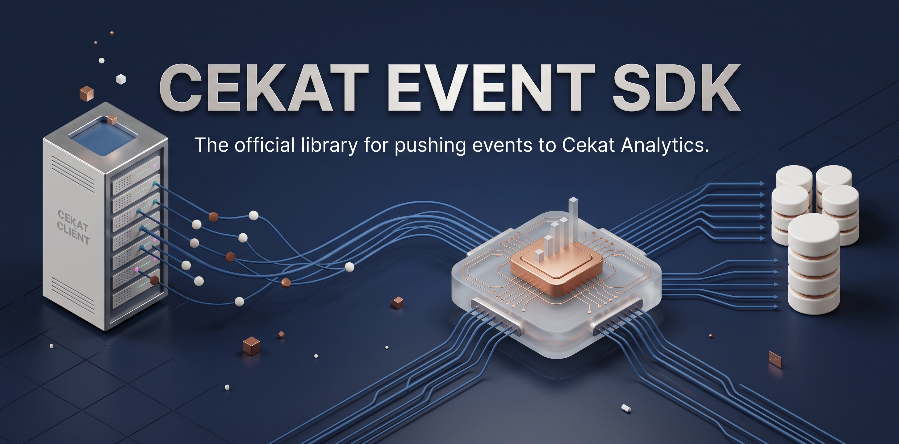

Backend SDKs that submit Cekat events and correlate them with the browser visitor. Implemented: [Go](go/README.md), [Node.js and Bun](node/README.md), [Python](python/README.md), [PHP](php/README.md), [Ruby](ruby/README.md), [Java](java/README.md), and [.NET](dotnet/README.md).

## How to use

Every SDK works the same way::

1. **Install** the package for your language.
2. **Create one client** with your Cekat access token (server-side only; never ship it to a browser) and **send events**: a common event such as `user_login`, or a custom event with your own key.
3. **Add the middleware** for your web framework.

**Why the middleware?** The Cekat browser SDK remembers each anonymous visitor in the `_cekat_visitor_id` cookie (or sends it as the `X-Cekat-Visitor-ID` header to cross-origin APIs). The middleware reads that value on every request, so any event you send while handling the request carries the visitor ID automatically. When an event has both the visitor ID and an email or phone number, Cekat links the anonymous visitor to that contact.

**Without middleware**, read the cookie yourself and pass it as the event's visitor ID, as each section below shows. Visitor IDs come from the browser and are untrusted: use them only for this correlation, never for authentication.

<details>
<summary><strong>Go</strong></summary>

**Install**

```sh
go get golang.cekat.ai/event-sdk
go get golang.cekat.ai/event-sdk/middleware/gin   # only the adapter for your framework: gin, echo, fiber, or chi
```

**Send events**

```go
import cekat "golang.cekat.ai/event-sdk"

client, err := cekat.New(os.Getenv("CEKAT_ACCESS_TOKEN"))

// Common event
_, err = client.UserLogin(r.Context(), cekat.Event{Email: "ada@example.com"})

// Custom event
_, err = client.CustomEvent(r.Context(), "trial_started", cekat.Event{
    Email:      "ada@example.com",
    Properties: map[string]any{"plan": "pro"},
})
```

**Middleware** (pass the request's context to the client, as shown)

```go
// net/http — import cekatnethttp "golang.cekat.ai/event-sdk/middleware/nethttp"
mux.Handle("/login", cekatnethttp.Middleware(http.HandlerFunc(login)))       // client.UserLogin(r.Context(), ...)

// Gin — import cekatgin "golang.cekat.ai/event-sdk/middleware/gin"
router.Use(cekatgin.Middleware())                                             // client.UserLogin(c.Request.Context(), ...)

// Echo — import cekatecho "golang.cekat.ai/event-sdk/middleware/echo"
e.Use(cekatecho.Middleware())                                                 // client.UserLogin(c.Request().Context(), ...)

// Fiber — import cekatfiber "golang.cekat.ai/event-sdk/middleware/fiber"
app.Use(cekatfiber.Middleware())                                              // client.UserLogin(c.Context(), ...)

// Chi — import cekatchi "golang.cekat.ai/event-sdk/middleware/chi"
r.Use(cekatchi.Middleware)                                                    // client.UserLogin(r.Context(), ...)
```

**Without middleware**

```go
visitorID := ""
if cookie, err := r.Cookie("_cekat_visitor_id"); err == nil {
    visitorID = cookie.Value
}
_, err = client.UserLogin(r.Context(), cekat.Event{Email: "ada@example.com", VisitorID: visitorID})
```

More: [go/README.md](go/README.md)

</details>

<details>
<summary><strong>Node.js and Bun</strong></summary>

**Install**

```sh
npm install @cekatai/event-sdk    # or: bun add @cekatai/event-sdk
```

**Send events**

```ts
import { Client } from '@cekatai/event-sdk';

const cekat = new Client(process.env.CEKAT_ACCESS_TOKEN!);

// Common event
await cekat.userLogin({ email: 'ada@example.com' });

// Custom event
await cekat.customEvent('trial_started', { email: 'ada@example.com', properties: { plan: 'pro' } });
```

**Middleware**

```ts
// Express
import { visitorMiddleware } from '@cekatai/event-sdk/express';
app.use(visitorMiddleware());

// Fastify
import { visitorPlugin } from '@cekatai/event-sdk/fastify';
await app.register(visitorPlugin);

// Koa
import { visitorMiddleware as cekatVisitor } from '@cekatai/event-sdk/koa';
app.use(cekatVisitor());

// NestJS (in your module's configure(consumer))
import { CekatVisitorMiddleware } from '@cekatai/event-sdk/nestjs';
consumer.apply(CekatVisitorMiddleware).forRoutes('*');

// Next.js, Node runtime only. Pages Router, pages/api/login.ts:
import { withCekatVisitor } from '@cekatai/event-sdk/nextjs';
export default withCekatVisitor(async (req, res) => { await cekat.userLogin({ email: req.body.email }); res.end(); });

// Next.js App Router, app/api/login/route.ts (also add: export const runtime = 'nodejs'):
import { runWithCekatVisitor } from '@cekatai/event-sdk/nextjs';
export async function POST(request: Request) {
  return runWithCekatVisitor(request, async () => { await cekat.userLogin({ email: 'ada@example.com' }); return new Response('ok'); });
}

// Bun.serve, Hono, Elysia
import { withCekatVisitor as withVisitor, runWithCekatVisitor as runWithVisitor } from '@cekatai/event-sdk/fetch';
Bun.serve({ fetch: withVisitor(app.fetch) });              // wraps any fetch handler, including Hono and Elysia apps
honoApp.use((c, next) => runWithVisitor(c.req.raw, next)); // or as Hono middleware
```

**Without middleware** (Express with `cookie-parser`)

```ts
await cekat.userLogin({ email: 'ada@example.com', visitorId: req.cookies._cekat_visitor_id });
```

More: [node/README.md](node/README.md)

</details>

<details>
<summary><strong>Python</strong></summary>

**Install**

```sh
pip install cekat-event-sdk    # extras: "cekat-event-sdk[django]", [flask], [asgi], or [fastapi]
```

**Send events**

```python
import os
from cekat_event_sdk import Client, Event

cekat = Client(os.environ["CEKAT_ACCESS_TOKEN"])   # AsyncClient offers the same methods with await

# Common event
cekat.user_login(Event(email="ada@example.com"))

# Custom event
cekat.custom_event("trial_started", Event(email="ada@example.com", properties={"plan": "pro"}))
```

**Middleware**

```python
# Django: settings.py
MIDDLEWARE = [
    # ...
    "cekat_event_sdk.integrations.django.DjangoVisitorMiddleware",
]

# Flask
from cekat_event_sdk.integrations.flask import CekatVisitor
CekatVisitor(app)

# FastAPI and Starlette
from cekat_event_sdk.integrations.asgi import VisitorMiddleware
app.add_middleware(VisitorMiddleware)
```

**Without middleware**

```python
visitor_id = request.cookies.get("_cekat_visitor_id")   # Django: request.COOKIES.get("_cekat_visitor_id")
cekat.user_login(Event(email="ada@example.com", visitor_id=visitor_id))
```

More: [python/README.md](python/README.md)

</details>

<details>
<summary><strong>PHP</strong></summary>

**Install**

```sh
composer require cekat/event-sdk
```

**Send events**

```php
use Cekat\EventSdk\Client;
use Cekat\EventSdk\EventInput;

$cekat = new Client(getenv('CEKAT_ACCESS_TOKEN'));

// Common event
$cekat->userLogin(new EventInput(email: 'ada@example.com'));

// Custom event
$cekat->customEvent('trial_started', new EventInput(email: 'ada@example.com', properties: ['plan' => 'pro']));
```

**Middleware**

```php
// Laravel: set 'cekat' => ['access_token' => env('CEKAT_ACCESS_TOKEN')] in config/services.php,
// then in bootstrap/app.php (inject Cekat\EventSdk\Client where you send events):
use Cekat\EventSdk\Integration\Laravel\VisitorMiddleware;
->withMiddleware(function (Middleware $middleware) {
    $middleware->append(VisitorMiddleware::class);
})

// PSR-15 (Slim, Mezzio, and others)
use Cekat\EventSdk\Integration\Psr15\VisitorMiddleware as CekatVisitorMiddleware;
$app->add(new CekatVisitorMiddleware());
```

```yaml
# Symfony: config/services.yaml
services:
    Cekat\EventSdk\Context\VisitorContextInterface:
        class: Cekat\EventSdk\Context\VisitorContext
    Cekat\EventSdk\Client:
        arguments:
            $accessToken: '%env(CEKAT_ACCESS_TOKEN)%'
            $visitorContext: '@Cekat\EventSdk\Context\VisitorContextInterface'
    Cekat\EventSdk\Integration\Symfony\VisitorContextKernel:
        decorates: http_kernel
        arguments: ['@.inner', '@Cekat\EventSdk\Context\VisitorContextInterface']
```

**Without middleware**

```php
$cekat->userLogin(new EventInput(email: 'ada@example.com', visitorId: $_COOKIE['_cekat_visitor_id'] ?? null));
```

More: [php/README.md](php/README.md)

</details>

<details>
<summary><strong>Java</strong></summary>

**Install** (Maven; use `cekat-event-sdk-jakarta-servlet` for a plain servlet app, or `cekat-event-sdk-core` for the client alone)

```xml
<dependency>
  <groupId>ai.cekat</groupId>
  <artifactId>cekat-event-sdk-spring-boot</artifactId>
  <version>0.1.0</version>
</dependency>
```

**Send events**

```java
CekatClient cekat = new CekatClient(System.getenv("CEKAT_ACCESS_TOKEN"));

// Common event
cekat.userLogin(Event.builder().email("ada@example.com").build());

// Custom event
cekat.customEvent("trial_started", Event.builder().email("ada@example.com").property("plan", "pro").build());
```

**Middleware**

```properties
# Spring Boot: the visitor filter registers automatically; set the token to get an injectable CekatClient bean
cekat.access-token=${CEKAT_ACCESS_TOKEN}
```

```java
// Jakarta Servlet
FilterRegistration.Dynamic filter = servletContext.addFilter("cekatVisitorFilter", new CekatVisitorFilter());
filter.setAsyncSupported(true);
filter.addMappingForUrlPatterns(EnumSet.of(DispatcherType.REQUEST, DispatcherType.ASYNC, DispatcherType.ERROR), false, "/*");
```

**Without middleware** (Spring MVC)

```java
@PostMapping("/login")
void login(@CookieValue(name = "_cekat_visitor_id", required = false) String visitorId) throws InterruptedException {
    cekat.userLogin(Event.builder().email("ada@example.com").visitorId(visitorId).build());
}
```

More: [java/README.md](java/README.md)

</details>

<details>
<summary><strong>.NET</strong></summary>

**Install**

```sh
dotnet add package Cekat.EventSdk.AspNetCore        # or Cekat.EventSdk.AzureFunctions, or Cekat.EventSdk for the client alone
```

**Send events**

```csharp
using Cekat.EventSdk;

var cekat = new CekatClient(new CekatClientOptions { AccessToken = Environment.GetEnvironmentVariable("CEKAT_ACCESS_TOKEN") });

// Common event
await cekat.UserLoginAsync(new EventInput(Email: "ada@example.com"));

// Custom event
await cekat.CustomEventAsync("trial_started", new EventInput(Email: "ada@example.com", Properties: new Dictionary<string, object?> { ["plan"] = "pro" }));
```

**Middleware**

```csharp
// ASP.NET Core: Program.cs (inject CekatClient into your endpoints)
builder.Services.AddCekatEventSdk(options => options.AccessToken = builder.Configuration["Cekat:AccessToken"]);
var app = builder.Build();
app.UseCekatVisitor();

// Azure Functions (isolated worker): Program.cs
var functions = FunctionsApplication.CreateBuilder(args);
functions.UseCekatVisitor();
functions.Services.AddCekatEventSdk(options => options.AccessToken = Environment.GetEnvironmentVariable("CEKAT_ACCESS_TOKEN"));
functions.Build().Run();
```

**Without middleware**

```csharp
await cekat.UserLoginAsync(new EventInput(Email: "ada@example.com", VisitorId: httpContext.Request.Cookies["_cekat_visitor_id"]));
```

More: [dotnet/README.md](dotnet/README.md)

</details>

<details>
<summary><strong>Ruby</strong></summary>

**Install**

```sh
bundle add cekat-event-sdk
```

**Send events**

```ruby
require "cekat_event_sdk"

CEKAT = CekatEventSdk::Client.new(access_token: ENV.fetch("CEKAT_ACCESS_TOKEN"))

# Common event
CEKAT.user_login(email: "ada@example.com")

# Custom event
CEKAT.custom_event("trial_started", email: "ada@example.com", properties: { plan: "pro" })
```

**Middleware**

```ruby
# Rails: nothing to add; the middleware is inserted automatically.
# Create the client in config/initializers/cekat.rb as shown above.

# Rack (Sinatra, Hanami, Roda, and others): config.ru
use CekatEventSdk::Rack::Middleware
```

**Without middleware** (Rails controller)

```ruby
CEKAT.user_login(email: "ada@example.com", visitor_id: cookies[:_cekat_visitor_id])
```

More: [ruby/README.md](ruby/README.md)

</details>

The middleware also prefers a nonblank `X-Cekat-Visitor-ID` header over the cookie. If you read the value yourself for cross-origin requests, check that header first, then the cookie.

## Documentation

- [SDK contract](docs/sdk-contract.md): client settings, the request and payload, the five operations, acknowledgements, and error categories shared by every SDK.
- [Visitor propagation](docs/visitor-propagation.md): how the browser visitor ID reaches events, precedence, the trust boundary, and each framework integration.
- [Retries and errors](docs/retry-and-error-semantics.md): timeouts, retry rules, `Retry-After`, duplicates, response classification, and cancellation.
- [Compatibility](docs/compatibility.md): supported runtimes and frameworks, generated from `ci/compatibility-matrix.json`.
- [Release checklist](docs/release-checklist.md): version rechecks, release readiness, and the manual publication gates.
- [Shared conformance](conformance/README.md): the executable contract every SDK must pass.

## Shared conformance

Every SDK runs the same language-neutral fixtures (`conformance/fixtures/cases`) against a real HTTP mock of the ingest API (`conformance/mock-ingest-server`). See [conformance/README.md](conformance/README.md) for the contract.

```sh
scripts/conformance.sh                    # every language that has a runner
scripts/conformance.sh --language php     # one language
```

For each language, the script builds the Go mock server (or uses `MOCK_INGEST_SERVER_BIN`), starts a private instance on a random loopback port, waits for its readiness record and control API, runs `<language>/scripts/conformance` with exactly the four `CEKAT_CONFORMANCE_*` variables, and stops the server. It requires Go, `python3`, and each language's own toolchain. A language passes only when its runner exits 0, its mock server stays up, and the runner's result lines account for every fixture exactly once (`passed`, or `not_applicable` where the fixture declares that language inapplicable); processes a runner leaves behind are stopped.

## Compatibility matrix

`ci/compatibility-matrix.json` records, for each SDK, the declared runtime floors, the CI versions, the observed exact versions, supported frameworks, and upcoming end-of-support dates. `scripts/validate-compatibility-matrix.py` fails when it disagrees with the package metadata, `ci.yml`, `release-readiness.yml`, or the language's evidence document, so a changed floor, CI row, or framework range must be updated in all of them together.

```sh
python3 scripts/validate-compatibility-matrix.py                                    # drift checks (runs in CI)
python3 scripts/validate-compatibility-matrix.py --as-of "$(date -u +%F)" --max-age-days 30 --markdown   # release gates and summary
```

With `--as-of`, it also fails when a supported line has reached end of support or the evidence is older than the given age, and warns about lines ending within 90 days. [docs/compatibility.md](docs/compatibility.md) is generated from the matrix with `python3 scripts/audit-docs.py --write-compatibility`.

`python3 scripts/audit-docs.py` checks the root README, the documents under `docs/`, the conformance guide, and the seven language READMEs: links and anchors, required contract terms, exact protocol names, unfinished markers, token-like secrets, publication claims, and that each README names its matrix runtime floor and frameworks. It runs in CI.

## Continuous integration

`.github/workflows/ci.yml` runs on every pull request and on pushes to `main`: the conformance contract and mock server tests, then minimum and current runtime profiles for each SDK (unit, integration, and shared conformance). The `CI required` job succeeds only when every other job succeeds, so it is the single check to require in branch protection.

## Release readiness

Before any release, run the **Release readiness** workflow (`.github/workflows/release-readiness.yml`, manual trigger only). It builds every SDK with its own `scripts/package` on the current toolchain, validates each `manifest.json` and the complete seven-language set, and keeps the artifacts for 14 days with a summary table of file names, sizes, and SHA-256 hashes.

Locally (each language's toolchain must be installed):

```sh
scripts/package-readiness.sh --language node --output /absolute/empty/dir   # one language, into <dir>/node
scripts/package-readiness.sh --all --output /absolute/empty/dir             # all seven, then aggregate validation
python3 scripts/validate-package-manifest.py --all /absolute/empty/dir       # re-check an existing set
python3 -m unittest discover -s scripts/tests -p 'test_*.py'                # root script tests
```

`ci/package-manifest.schema.json` documents the manifest format; `scripts/validate-package-manifest.py` enforces it, including the exact file set, sizes, and hashes.

## Releasing

Each release starts the same way: a release owner pushes that language's version tag on a commit that is already on `main` and green. The workflow then rebuilds the package with `scripts/package-readiness.sh`, checks the tag against the version declared in the package metadata, and waits for approval in a GitHub environment before anything leaves the repository. No registry credentials are stored: npm, PyPI, and RubyGems all authenticate with trusted publishing, using a short-lived token issued for that one run.

| Language | Tag | Workflow | Environment | What the approved job does |
| --- | --- | --- | --- | --- |
| Go | `go/vX.Y.Z` | `release-go.yml` | `go-release` | Checks that every adapter requires the core version being released, creates the four `go/middleware/*/vX.Y.Z` tags at the same commit, publishes a GitHub Release per module, and asks the public module proxy for each module path. Go has no registry upload: the tags are the release. |
| Node.js | `node/vX.Y.Z` | `release-node.yml` | `npm` | Verifies the tarball's name, version, and hashes, then publishes it to npm with provenance. |
| Python | `python/vX.Y.Z` | `release-python.yml` | `pypi` | Verifies the manifest, then uploads the wheel and sdist to PyPI with attestations. |
| Ruby | `ruby/vX.Y.Z` | `release-ruby.yml` | `rubygems` | Verifies the manifest and the name and version inside the gem, then pushes that gem file to RubyGems. |
| Java | `java/vX.Y.Z` | `release-java.yml` | `maven-central` | Verifies the manifest, signs every file with the release key, adds checksums, and uploads the bundle to the Sonatype Portal. It stops at `VALIDATED`: a release owner presses Publish, because a Maven Central version can never be replaced. |
| PHP | `php/vX.Y.Z` | `release-php.yml` | `packagist` | Mirrors this tag's `php/` directory to `cekataiofficial/cekat-event-sdk-php`, where `composer.json` sits at the repository root, and tags it `vX.Y.Z` for Packagist to read. |
| .NET | `dotnet/vX.Y.Z` | `release-dotnet.yml` | `nuget` | Verifies the manifest, exchanges the job's OIDC token for a one-hour key, and pushes the three `Cekat.EventSdk` packages to nuget.org. |

Every one of these refuses a version that already exists in the registry, so a re-run cannot overwrite a release. npm, PyPI, RubyGems, and NuGet authenticate with trusted publishing and store no credentials; Maven Central and Packagist offer none, so those two workflows read secrets from their own approval-gated environments.

The [release checklist](docs/release-checklist.md) covers the registry setup for each language, the per-release steps, and the gates that stay manual, such as changelog approval and the final Publish click for Maven Central.
